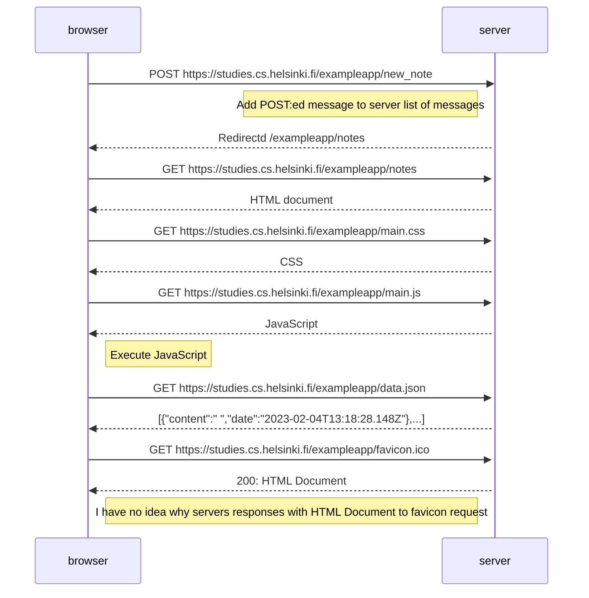

```mermaid
sequenceDiagram
    participant browser
    participant server
    
    browser->>server: POST https://studies.cs.helsinki.fi/exampleapp/new_note
    activate server

    Note left of server: Add POST:ed message to server list of messages

    server-->>browser: Redirectd /exampleapp/notes

    browser->>server: GET https://studies.cs.helsinki.fi/exampleapp/notes
    activate server
    server-->>browser: HTML document

    browser->>server: GET https://studies.cs.helsinki.fi/exampleapp/main.css
    activate server
    server-->>browser: CSS

    browser->>server: GET https://studies.cs.helsinki.fi/exampleapp/main.js
    activate server
    server-->>browser: JavaScript

    Note right of browser: Execute JavaScript

    browser->>server: GET https://studies.cs.helsinki.fi/exampleapp/data.json
    activate server
    server-->>browser: [{"content":" ","date":"2023-02-04T13:18:28.148Z"},...]

    browser->>server: GET https://studies.cs.helsinki.fi/exampleapp/favicon.ico
    activate server
    server-->>browser: 200: HTML Document
    
    Note left of server: I have no idea why servers responses with HTML Document to favicon request


```
