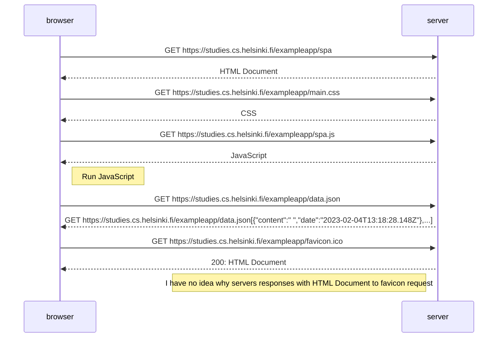

```mermaid
sequenceDiagram
    participant browser
    participant server
    
    browser->>server: GET  https://studies.cs.helsinki.fi/exampleapp/spa
    activate server

    server-->>browser: HTML Document

    browser->>server: GET  https://studies.cs.helsinki.fi/exampleapp/main.css
    
    server-->>browser: CSS

    browser->>server: GET  https://studies.cs.helsinki.fi/exampleapp/spa.js
    
    server-->>browser: JavaScript

    Note right of browser: Run JavaScript

    browser->>server: GET  https://studies.cs.helsinki.fi/exampleapp/data.json
    
    server-->>browser: GET  https://studies.cs.helsinki.fi/exampleapp/data.json[{"content":" ","date":"2023-02-04T13:18:28.148Z"},...]

    browser->>server: GET https://studies.cs.helsinki.fi/exampleapp/favicon.ico
    activate server
    server-->>browser: 200: HTML Document

    Note left of server: I have no idea why servers responses with HTML Document to favicon request


```
